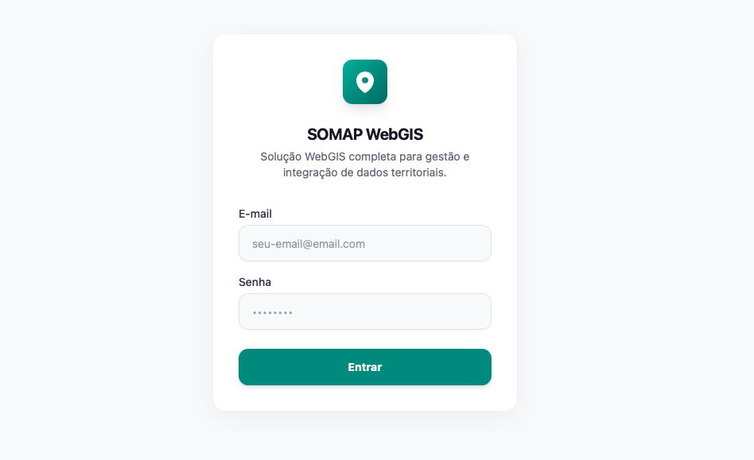
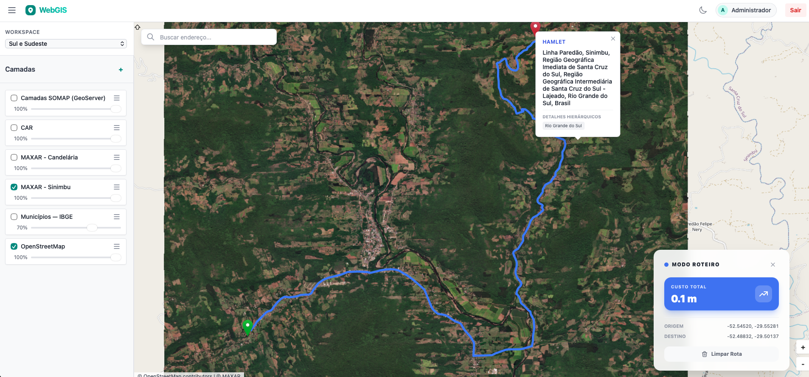

# SOMAP — Spatial Observation and MAPping

**SOMAP** é uma plataforma WebGIS desenvolvida para visualização, análise e gestão de dados geoespaciais com alta performance e usabilidade. A plataforma integra um mapa interativo com suporte a múltiplos tipos de camadas, geocodificação, busca de endereços e cálculo de rotas sobre a rede viária.

O projeto é construído inteiramente no navegador, sem plugins ou instalações adicionais, e se conecta a serviços de mapas e backend próprios hospedados localmente via Cloudflare Tunnel.

---

## Interface

### Tela de Login



### Mapa Interativo



---

## Funcionalidades

**Visualização de Camadas**
Suporte a múltiplos tipos de fonte geoespacial num painel lateral com controle de visibilidade, opacidade e reordenação por drag-and-drop:
- `XYZ` — tiles de raster (OpenStreetMap, imagens de satélite MAXAR)
- `WMS` — serviços OGC (IBGE, GeoServer próprio)
- `GeoJSON` — vetores estáticos ou servidos pelo backend
- `WFS` — features vetoriais via protocolo OGC

**Workspaces**
As camadas são organizadas em workspaces (conjuntos de dados temáticos), alternáveis via seletor no painel lateral.

**Busca e Geocodificação**
Barra de busca que consulta uma instância local do **Nominatim (OpenStreetMap)** para converter endereços em coordenadas (forward geocoding). Cliques no mapa disparam geocodificação reversa, exibindo o endereço num popup com detalhes hierárquicos (bairro, cidade, estado).

**Roteirização**
Modo de roteiro que permite selecionar dois pontos no mapa (A → B) e calcula a rota sobre a rede viária via backend próprio com **pgRouting**. A rota é renderizada como camada vetorial azul sobre o mapa, com zoom automático na extensão calculada e exibição do custo total (em metros ou quilômetros).

**Dark Mode**
Alternância entre tema claro e escuro via botão na barra de ferramentas.

---

## Arquitetura

```
Frontend (Vue 3 + OpenLayers)
    │
    ├── /api/*          → Backend Python/FastAPI  (autenticação, camadas, rotas)
    ├── Nominatim       → Geocodificação (instância local OSM)
    └── GeoServer       → Serviço WMS/WFS de camadas vetoriais e raster
```

O frontend utiliza **MSW (Mock Service Worker)** em ambiente de desenvolvimento para simular o backend, permitindo desenvolvimento e testes sem dependência de infraestrutura ativa. Em produção, os serviços são expostos via **Cloudflare Tunnel** a partir de um servidor local **Umbrel OS**.

---

## Stack

| Camada | Tecnologia |
|---|---|
| Framework UI | Vue 3 (Composition API) |
| Build | Vite |
| Linguagem | TypeScript |
| Mapa | OpenLayers 10 |
| Estado global | Pinia |
| Estilização | Tailwind CSS |
| Roteamento | Vue Router |
| Mocks | MSW 2 (Mock Service Worker) |

---

## Deploy

O frontend é publicado automaticamente no **GitHub Pages** via GitHub Actions a cada push na branch `main`. O pipeline executa verificação de tipos (`vue-tsc`) e build de produção antes do deploy.
